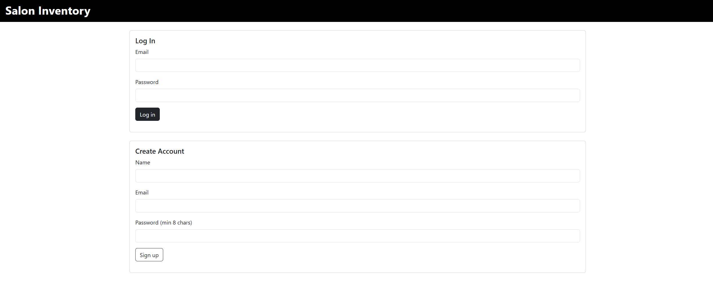
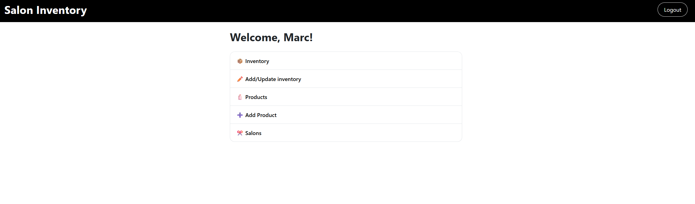
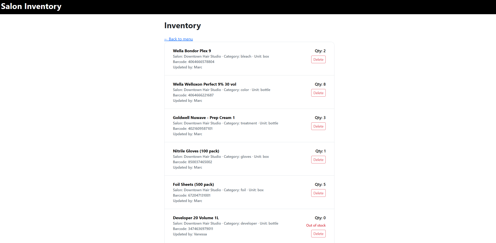
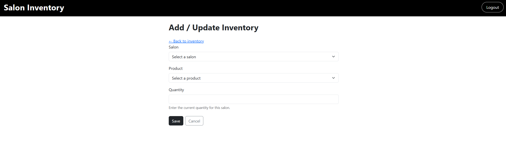

# Salon Inventory Management System

A full-stack web application that allows salon owners and staff to manage products and inventory across multiple salon locations.  
The system supports authentication, inventory tracking, and barcode-based product lookup via an external API.

Internal tool to manage inventory and order approvals across teams — replaces spreadsheets and manual processes.


**Screenshots:**





---

## 📌 Features

- User authentication (login & signup)
- Product management (create, view, delete)
- Salon management
- Inventory tracking per salon
- Add or update inventory quantities
- External barcode lookup API integration
- Responsive UI built with Bootstrap
- Secure session-based access control

---

## 🧱 Tech Stack

**Frontend**
- Handlebars.js
- Bootstrap 5
- Vanilla JavaScript

**Backend**
- Node.js
- Express.js
- Sequelize ORM
- PostgreSQL
- Express-session

**External API**
- Barcode Lookup API

---

## 🗂️ Architecture

This project follows the **MVC (Model–View–Controller)** pattern:

- `models/` – Sequelize models and associations
- `controllers/` – API and page routes
- `views/` – Handlebars templates and partials
- `public/` – Client-side JavaScript and CSS
- `utils/` – Authentication middleware

---

## 🔐 Authentication

- Users must be logged in to access protected routes
- Sessions are stored server-side
- Ownership is enforced (e.g. products are linked to the user who created them)

---

## 📦 Inventory Logic

- Inventory is uniquely identified by **salon + product**
- Inventory creation uses a **find-or-create + update** strategy
- Database constraints prevent duplicate inventory rows
- Products cannot be deleted if they are referenced by inventory records

---

## 🔍 External API Integration

The application integrates a third-party **Barcode Lookup API** to fetch product details using barcodes.

- Graceful error handling when the API is unavailable
- User-friendly messages instead of raw JSON errors

---

## 📱 Responsive Design

- Mobile-first layout using Bootstrap
- Lists and forms adapt cleanly to all screen sizes
- Consistent UI philosophy across pages

---

## 🚀 Installation & Setup

### 1. Clone the repository
```bash
git clone https://github.com/your-username/salon-inventory.git
cd salon-inventory
```
2. Install dependencies
```bash
npm install
```
3. Configure environment variables
Create a .env file:

```bash
DB_NAME=salon_inventory_db
DB_USER=your_db_user
DB_PASSWORD=your_db_password
SESSION_SECRET=your_secret
API_KEY=your_barcode_api_key
API_URL=https://api.barcodelookup.com/v3/products
```

4. Initialize the database
```bash
npm run seed
```
5. Start the server
```bash
npm start
```

Visit:
```bash
http://localhost:3001
```

## 📊 Seed Data
```bash
npm run seed
```


## 🌍 Deployed Application
👉 **Live Demo:**
https://salon-inventory.onrender.com/login

👉 **GitHub Repository:**  
https://github.com/MarcFGomes/week15-16-Project

## 🧠 Lessons Learned
Designing relational data models

Enforcing ownership and data integrity

Handling external API failures gracefully

Building maintainable CRUD workflows

Applying MVC principles in a real project

## ✍️ Author
Marc Gomes
Full-Stack Web Development Student

## 📄 License
This project is licensed under the MIT License.